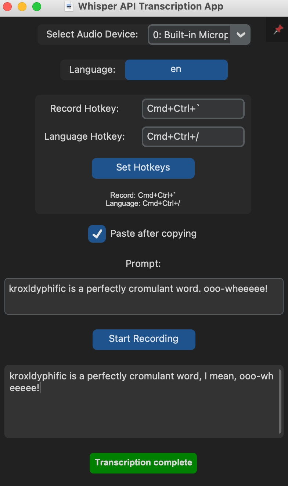

# Whisper API Dictation App

tl;dr This is my home-brew replacement of macOS dictation for myself.

The Whisper API Transcription App is a Python-based desktop application that allows users to record audio and  transcribe it using any OpenAI compatible Whisper API endpoint. I run this on <a href="https://github.com/fedirz/faster-whisper-server">fedirz/faster-whisper-server</a>.  It automatically copies the transcription to the clipboard and pastes it into the active window. 

Screenshot of the application: 

## Important Notes

- This application requires Python 3.10 or higher.
- It has only been tested on an older Mac and not on Apple Silicon.
- If you're using a Mac, you may need to install the PortAudio library using Homebrew.
- This application is provided as-is, without any warranty or liability. Use at your own risk.
- There is no official support for this application.

## Features

- Real-time audio recording and transcription
- Support for multiple languages (currently English and German, easily expandable)
- Customizable hotkeys for recording and language switching
- Quick language toggle between two preset languages
- Prompt input to guide the transcription process
- Control over prompt content for each transcription
- Automatic copying to clipboard and optional pasting of transcriptions into the active window
- Adjustable window size and position
- Graceful handling of application closing and errors
- Customizable activation, deactivation, and toggle sounds

## Security Warning

The application uses the clipboard to paste transcriptions into the active window. This could potentially be dangerous if you are in a context where text should not be pasted. Always be aware of your active window when using this feature.

## Requirements

- Python 3.10 or higher
- Customtkinter library
- Other dependencies listed in `requirements.txt`
- PortAudio library (for Mac users, install via Homebrew)

## Installation

1. Clone the repository or download the source code.
2. Run the installation script by executing: `python3 install.py`
   This script will install the required dependencies and create necessary directories.
3. Edit main.py and set the `TRANSCRIPTION_API_URL`  variable to the URL of your Whisper API server (optional, defaults to `http://10.68.7.2:8000/v1/audio/transcriptions`).  (sorry)

## Usage

1. Run the application by executing: `python3 main.py`
2. Select the desired audio input device from the dropdown menu.
3. Enter a prompt to guide the transcription process (optional).
4. Press the record hotkey (default: `Cmd+Ctrl+\``) to start recording.
5. Press the record hotkey again to stop recording and start the transcription process.
6. The transcribed text will be automatically copied to the clipboard and optionally pasted into the active window.
7. Use the language toggle hotkey to switch between the two preset languages.

## Customization

- Hotkeys can be customized in the application's settings menu.
- The window size and position can be adjusted by modifying the `geometry` parameters in the `TranscriptionApp` class.
- To add more languages, modify the language selection dropdown contents in the code.
- To use different languages for the quick toggle, substitute your desired two languages in the code.
- Custom sounds for activation, deactivation, and language toggles can be added to the assets directory.

## Troubleshooting

- If the application fails to start, ensure that all required dependencies are installed correctly.
- If you encounter issues with PyAudio, make sure you have PortAudio installed (for Mac users, use Homebrew).
- If the transcription process fails, check the API URL and make sure the Whisper API server is running and accessible.
- If the pasting functionality doesn't work as expected, try adjusting the delay between copying and pasting or using alternative methods to paste the text.

## Contributing

Contributions are welcome! Please submit a pull request or open an issue to discuss any changes or improvements.

## License

This project is licensed under the [MIT License](LICENSE).

## Disclaimer

This application is provided "as is" without warranty of any kind, either express or implied. Use at your own risk. The author(s) and contributor(s) are not responsible for any damage or data loss that may occur as a result of using this application.
